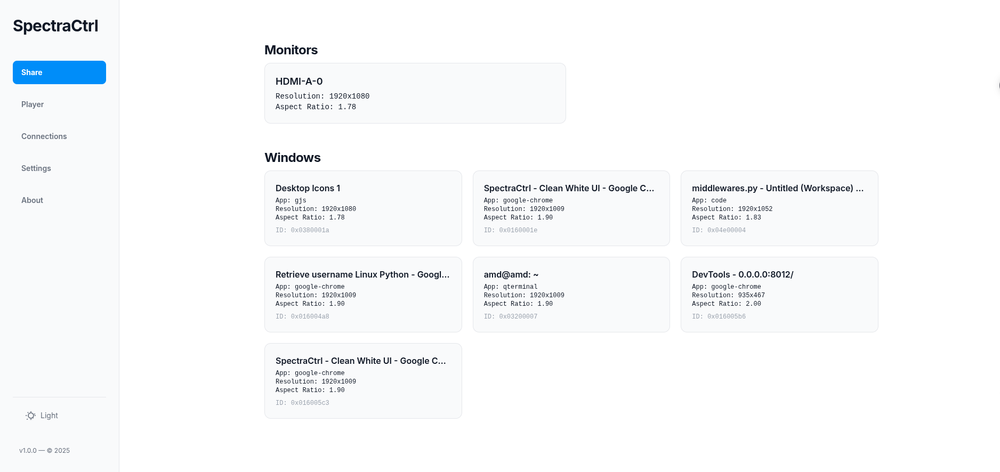

# SpectraCtrl

 
SpectraCtrl is a Python-based web application that allows you to view a Linux desktop screen in real-time through a web browser using WebSockets. It also provides basic (currently non-interactive with the web UI) mouse and keyboard control demonstrations.

## Features

- Real-time screen viewing via web browser using WebSockets.
- Predefined region screen capture.
- Basic demonstration scripts for mouse and keyboard control using `pynput` (not yet integrated into the web UI).
- FastAPI backend server.
- Simple HTML/JavaScript frontend.

## Support

| Platform       | Supported |
| -------------- | --------- |
| Linux Xorg/X11 | ✅ Yes     |
| Linux Wayland  | ❌ No      |
| Windows        | ❌ No      |
| Mac            | ❌ No      |

## Technology Stack

- **Backend:** Python, FastAPI, Uvicorn
- **Screen Capture:** `mss`
- **Input Control (Demo):** `pynput`
- **Real-time Communication:** WebSockets
- **Frontend:** HTML, CSS, JavaScript
- **Environment Management:** `venv`, `pip`

## Install Instruction

- Clone the repository: `git clone https://github.com/0xAungkon/SpectraCtrl --depth=1`
- Enter into the Directory: `cd SpectraCtrl`
- Install Dependency: `pip3 install -r requirements.txt`
- Run The Application: `python3 main.py`

## Top Priority TODO

- Wayland Support
- Implement Websocket for faster communication
- Add Keyboard Control
- Add Mouse Control
- Add Application Launch Capability
- Build Into Single Binary
- System Wide Installation

## FAQ:

- **Username Password?** => Your Desktop username & password
- **Does it support Windows?** => Currently No but seeking for contribution.
- **Does it support on Wayland?** => Currently No but seeking for contribution.